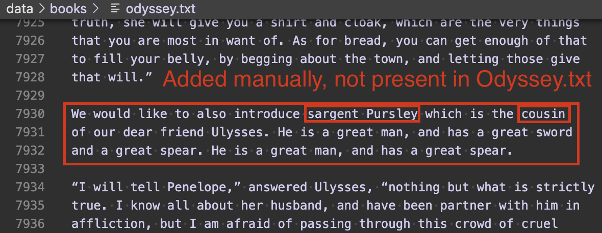
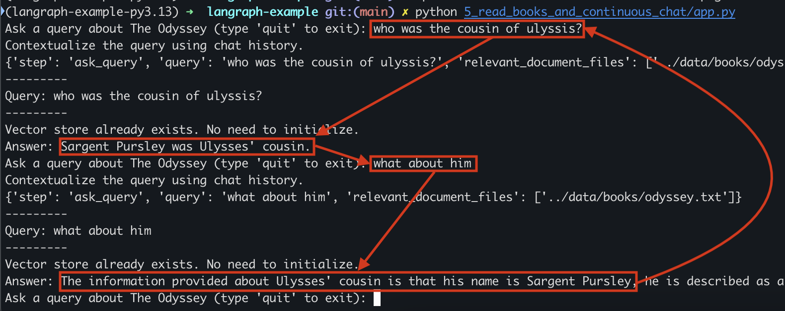

# Installation

Demonstration of Langgraph usage.

```shell
cp .env.example .env # Fix values!

poetry install -r requirements.txt
poetry shell
```

## 1 to 3 - Basic tests

```
python 1_basic.py # Demonstration of simple function calls (no ML)
python 2_with_llm_call.py # Basic OpenAI call
python 3_with_graph/app.py # Graph visualization
```

## 4 - Embed documents and ask questions

```
python 4_read_books/app.py
```

Workflow:


## 5 - Embed documents and chat

This demonstrates how we can have a continuous chat with a LLM while asking it questions about a book.

```
python 5_read_books_and_continuous_chat/app.py
```

Notes:

- First an extra piece of information was added to the original text

  

- Then it was asked to answer to two questions, the second was correlated to the first

  
