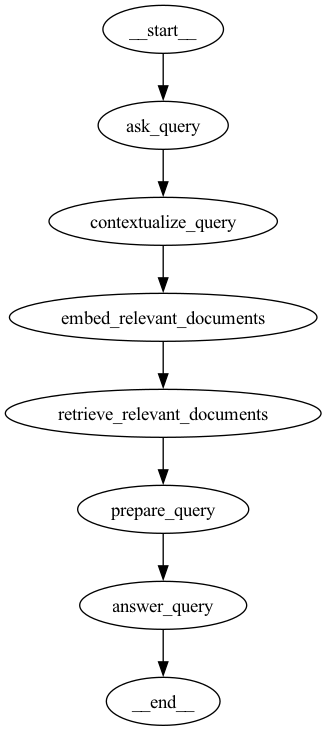

# Installation

Demonstration of Langgraph usage.

```shell
cp .env.example .env # Fix values!

poetry install -r requirements.txt
poetry shell

python 1_basic.py # Demonstration of simple function calls (no ML)
python 2_with_llm_call.py # Basic OpenAI call
python 3_with_graph/app.py # Graph visualization
python 4_read_books/app.py # Embed documents and answer questions
```

## 4 Read Books

```
python 4_read_books/app.py
```

This code demonstrates this workflow:


